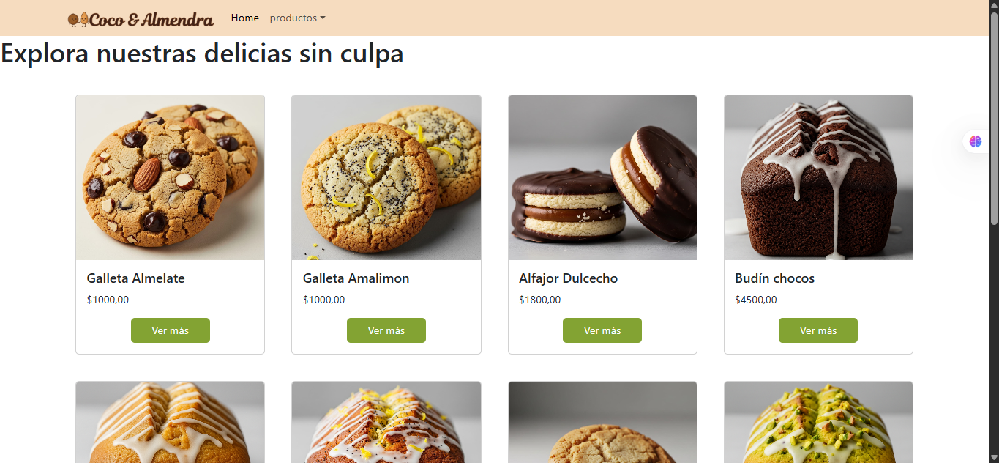

# Coco y Almendra

 E-commerce de pastelería saludable, desarrollado con React JS.

 ### Vista del sitio

 

### Instalación ⚙️

1. Clone el repositorio.
2. Hacer el comando `cd coco-y-almendra` para moverse a la carpeta del proyecto.
3. Instale dependencias con el comando `npm install`
4. Para levantar la app en el servidor local ejecute el comando `npm run dev`

### Librerias utilizadas 📖
- [React Bootstrap](https://react-bootstrap.netlify.app/): utilizada para el styling de la app.
- [React Router Dom](https://react-bootstrap.netlify.app/): utilizada para la navegación por rutas
- [Firebase](https://react-bootstrap.netlify.app/): utilizada como base de datos
- [Sweetalert2](https://sweetalert2.github.io/recipe-gallery/): utilizada para las alertas
- [Hook forms](https://react-hook-form.com/): utilizada para la validación de formularios

